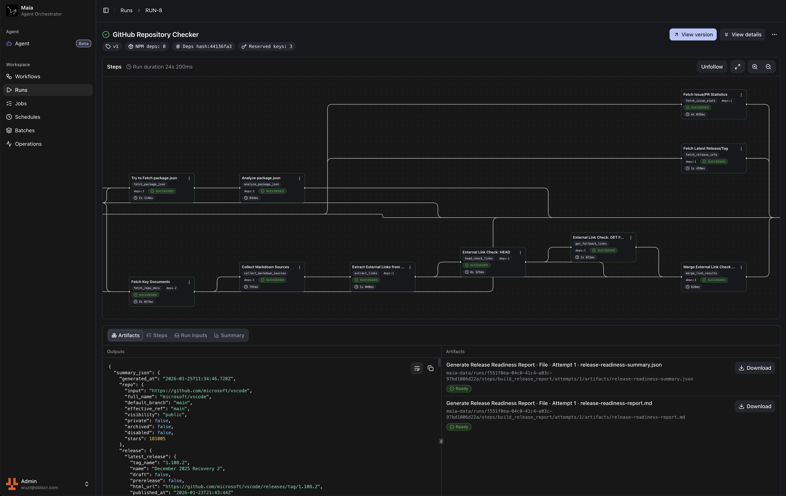

<p align="center">
  
</p>

<p align="center">
  <a href="./README.md">English</a> | <a href="./README.zh-cn.md"><b>中文</b></a>
</p>

# Maia

Maia 是一个**自托管的 DAG 工作流编排与执行服务**，面向长时运行的自动化任务，提供可观察、可调试与执行历史回放能力。

- **持久化**：基于 SQLite 持久化，保留运行状态、日志与输出
- **可观察**：实时 SSE 日志/事件流，并支持历史回放
- **隔离执行**：Runner 在沙箱容器内执行每次运行，推荐用于生产环境
- **可组合**：每个步骤显式定义输入/输出，并产出工件
- **可选代理**：按需启用，辅助工作流编写



## 快速开始（Docker，自托管）

Docker 部署包含两个服务：

- **App（控制平面）**：UI、调度/状态机、SQLite、SSE 事件流
- **Runner（执行平面）**：拉起/回收沙箱容器并回传 stdout/stderr

默认端口：`3690`（访问 `http://localhost:3690`）。

1) 下载部署文件：

```bash
curl -fsSL -o docker-compose.release.yml https://raw.githubusercontent.com/obiscr/maia/main/docker-compose.release.yml
curl -fsSL -o .env.production https://raw.githubusercontent.com/obiscr/maia/main/env.example
```

2) 编辑 `.env.production`（至少需要）：

- `RUNNER_TOKEN=...`（App 与 Runner 必须一致）

生产环境建议同时设置：

- `SETTINGS_ENCRYPTION_KEY=...`（敏感配置静态加密；建议长期保存）

3) 启动：

```bash
docker compose -f docker-compose.release.yml --env-file .env.production up -d
```

4) 初始化设置
打开 [http://localhost:3690](http://localhost:3690) 即可进行初始化设置。

### 从源码构建（可选）

```bash
git clone https://github.com/obiscr/maia.git
cd maia
cp env.example .env.production
```

编辑 `.env.production` 设置 `RUNNER_TOKEN` 后启动：

```bash
docker compose --env-file .env.production up -d --build
```

### 数据存储在哪里？

容器内的实例数据目录固定在 `/app/maia-data`，包括：

- `db.sqlite`（数据库）
- `runs/...`（运行输出/日志/输入）
- `workflows/...`（依赖快照）

默认情况下，Maia 使用 Docker 命名卷（推荐）。如果您更喜欢主机绑定挂载，请在环境变量文件中设置：

- `MAIA_DATA_MOUNT_TYPE=bind`
- `MAIA_HOST_DATA_DIR=/absolute/path/on/host`

然后重启：

```bash
# Docker Hub 部署（docker-compose.release.yml）
docker compose -f docker-compose.release.yml --env-file .env.production up -d

# 源码构建（docker-compose.yml）
docker compose --env-file .env.production up -d --build
```

## 版本发布

- 更新日志：`CHANGELOG.md`

## 运维（Docker）

以下命令默认针对 `docker-compose.release.yml`。如果您是源码构建部署，请改用对应的 compose 文件（通常是 `docker-compose.yml`），并按需加上 `--build`。

升级（保留数据）：

```bash
docker compose -f docker-compose.release.yml --env-file .env.production pull
docker compose -f docker-compose.release.yml --env-file .env.production up -d --remove-orphans
```

查看日志：

```bash
docker compose -f docker-compose.release.yml logs -f maia
docker compose -f docker-compose.release.yml logs -f runner
```

卸载并删除全部数据（谨慎操作）：

```bash
docker compose -f docker-compose.release.yml down -v
```

## 故障排除

- **`RUNNER_TOKEN_MISSING / UNAUTHORIZED`**：确保 `RUNNER_TOKEN` 已设置，且 App 和 Runner 中的值相同
- **`image not found: maia-sandbox` / `No such image: maia-sandbox:latest`**：
  - 如果您想要本地/离线镜像：运行 `docker build -f Dockerfile.sandbox -t maia-sandbox .` 并设置 `MAIA_SANDBOX_IMAGE=maia-sandbox`
  - 否则：设置 `MAIA_SANDBOX_IMAGE=obiscr/maia-sandbox:latest`（或升级您的 `docker-compose.release.yml`/`docker-compose.yml`），以便 Docker 可以自动拉取
- **绑定挂载写入失败（Linux / EACCES）**：确保主机目录可写（Runner 以 `65532:65532` 用户写入），例如 `sudo chown -R 65532:65532 <MAIA_HOST_DATA_DIR>`

## 本地开发（贡献者）

对于 UI/逻辑开发，Maia 可以在没有容器隔离的情况下运行：步骤在 App 进程中作为子进程执行。

前置要求：Node.js 20+、pnpm（通过 Corepack）、Git

```bash
pnpm install
pnpm dev
```

打开 `http://localhost:3000`。

要启用 Runner 或配置生产级设置（例如加密密钥），请使用 `env.example` 并创建 `.env.local`：

```bash
cp env.example .env.local
```

## 项目链接

- 贡献指南：`CONTRIBUTING.md`
- 安全：`SECURITY.md`
- 行为准则：`CODE_OF_CONDUCT.md`
- 代码库约定：`docs/CODEBASE_CONVENTIONS.md`

## 致谢

- 调色板灵感和部分 CSS 参考：**Starlight**（MIT）：`https://github.com/withastro/starlight`
- UI 组件设计（部分）灵感：**GitHub Actions**：`https://github.com/features/actions`
- 第三方声明：`THIRD_PARTY_NOTICES.md`

## 许可证

MIT（见 `LICENSE`）。
